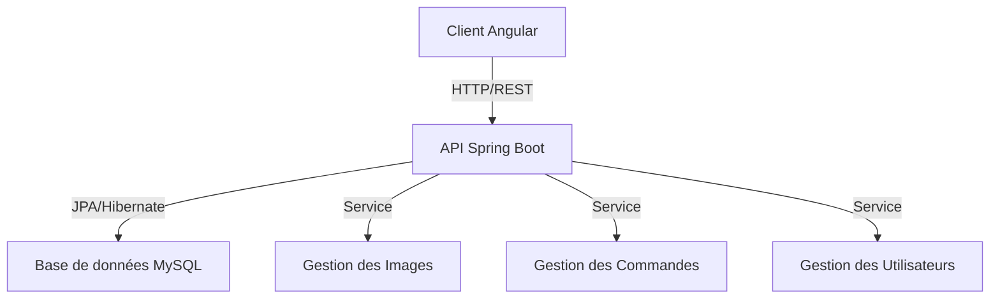

# 🛍️ Plateforme E-commerce

## 📝 Description

Cette plateforme e-commerce est une solution complète et moderne pour la vente en ligne, combinant la puissance d'Angular pour le frontend et Spring Boot pour le backend. Elle offre une expérience utilisateur fluide et responsive tout en garantissant une gestion robuste des données et des transactions.

### 🎯 Objectifs du Projet
- Créer une expérience d'achat en ligne intuitive et sécurisée
- Fournir aux administrateurs des outils puissants de gestion des produits et des commandes
- Offrir une plateforme évolutive capable de gérer un grand nombre de produits et d'utilisateurs
- Assurer une intégration transparente entre le frontend et le backend
- Garantir la sécurité des données et des transactions

### 💡 Points Forts
- Architecture moderne et modulaire
- Interface utilisateur intuitive et responsive
- Gestion complète du cycle de vente
- Sécurité renforcée des données
- Performance et évolutivité optimisées

<div align="center">


[](https://angular.io/)
[](https://spring.io/projects/spring-boot)
[](https://www.mysql.com/)

</div>

## ✨ Caractéristiques

### 🎯 Frontend (Angular)
- 🎨 Interface utilisateur moderne et responsive
- 🛒 Panier d'achat interactif
- 🔍 Recherche et filtrage des produits
- 👤 Gestion du profil utilisateur
- 💳 Processus de paiement sécurisé

### ⚡ Backend (Spring Boot)
- 🔐 Authentification et autorisation
- 📦 Gestion des produits
- 📝 Gestion des commandes
- 👥 Gestion des utilisateurs
- 🖼️ Gestion des images de produits

## 🚀 Installation

### Frontend
```bash
cd ecom_front
npm install
ng serve
```

### Backend
```bash
cd ecom-back
./mvnw spring-boot:run
```

## 🏗️ Architecture



## 🗃️ Structure du Projet

### Frontend (Angular)
- `src/app/` - Components, services et modules
- `src/assets/` - Images et ressources statiques
- `src/styles/` - Fichiers de style globaux

### Backend (Spring Boot)
- `src/main/java/` - Code source Java
  - `entities/` - Modèles de données
  - `repositories/` - Couche d'accès aux données
  - `services/` - Logique métier
  - `controllers/` - Points d'entrée API

## 🔧 Technologies Utilisées

### Frontend
- Angular 16+
- TailwindCSS
- TypeScript
- RxJS

### Backend
- Spring Boot
- Spring Data JPA
- Spring Security
- MySQL
- Maven

## 🤝 Contribution

Les contributions sont les bienvenues ! N'hésitez pas à :

1. 🍴 Forker le projet
2. 🔨 Créer une branche pour votre fonctionnalité
3. 📝 Commiter vos changements
4. 🚀 Pusher vers la branche
5. 🎉 Ouvrir une Pull Request

## 📄 Licence

Ce projet est sous licence [MIT](LICENSE)

---

<div align="center">
Développé avec ❤️ par Ayoub MOURADI
</div>
